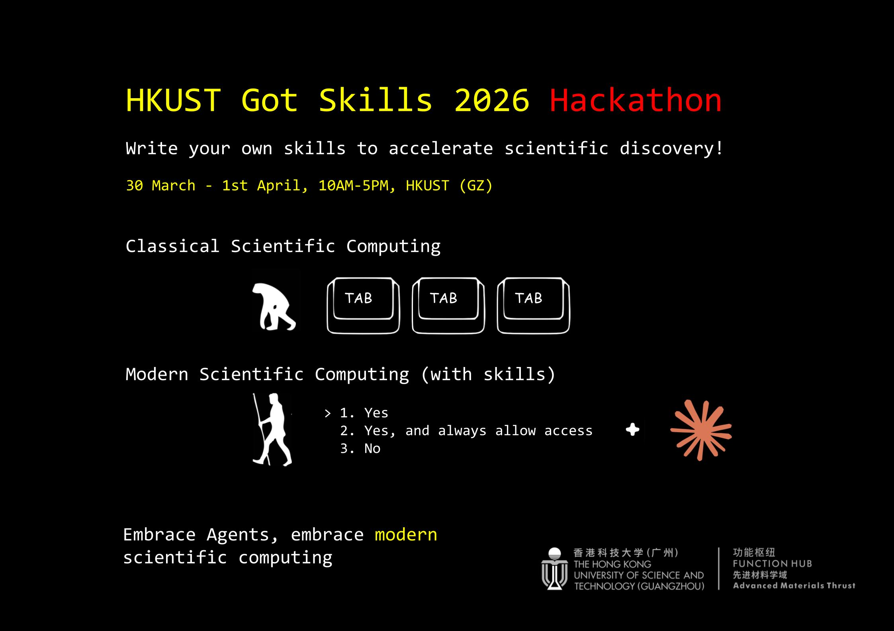

# HKUST-Got-Skills

**30th March - 1st April 2026**, W1-5F, 521H — [**HKUST(GZ)**](https://amat.hkust-gz.edu.cn/about/contact-directions/)

**Design a skill to automate and accelerate scientific discovery.**
A cross-campus hackathon bringing together HKUST(GZ) and HKUST(CWB) to build AI coding skills that transform scientific research workflows.

## What

Design and build **skills** — reusable automation modules for AI coding tools (Claude Code, Cursor, Codex CLI, OpenCode, and more) — that help scientists work faster and smarter.

Whether it's automating literature reviews, generating benchmark scripts, writing papers, or building computational libraries, your skill should make a real scientific workflow better.

We encourage all participants to **propose a workflow you want to automate** before the hackathon. What repetitive or time-consuming process in your research could an AI skill handle for you?

<a href="https://github.com/GiggleLiu/HKUST-Got-Skills/issues/new?template=project-idea.yml" class="btn">Submit Your Idea →</a>

## Registration

Invitation-only. Please contact [jinguoliu@hkust-gz.edu.cn](mailto:jinguoliu@hkust-gz.edu.cn) if you are interested in participating.

## Organizers

- **Jin-Guo Liu** — AMAT, HKUST(GZ) — [jinguoliu@hkust-gz.edu.cn](mailto:jinguoliu@hkust-gz.edu.cn)
- **Xi Dai** — Physics, HKUST(CWB)
