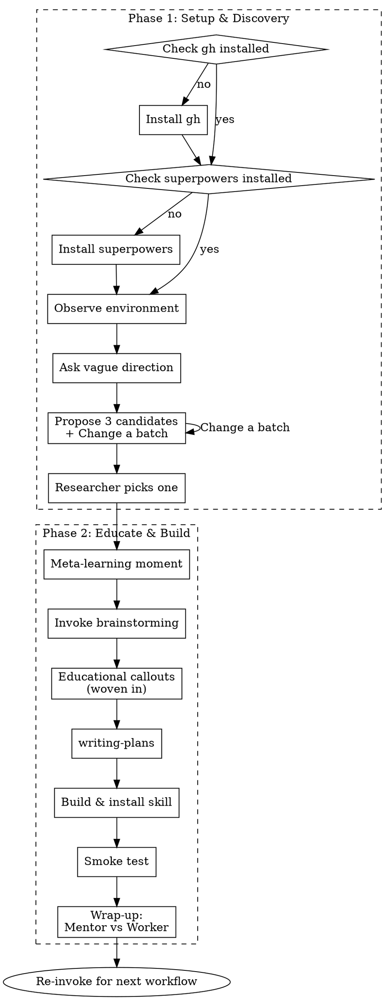

# learning-to-skill — Design Spec

## Overview

A skill that guides academic researchers through discovering automatable workflows and building their first Claude Code skill. The researcher already uses Claude Code but has never written a skill. The skill is educational — it teaches by doing.

**Location:** `~/.claude/skills/learning-to-skill/SKILL.md`

## Core Concept

The skill operates in two phases:

1. **Phase 1 — Setup & Discovery:** Install prerequisites (`gh` CLI and superpowers plugin), observe the researcher's environment, help them identify a workflow worth automating.
2. **Phase 2 — Educate & Build:** Invoke `superpowers:brainstorming` to design and build the skill, with educational callouts woven in.

One workflow per session. The researcher re-invokes for the next one.

## Phase 1: Setup & Discovery

### Step 1: Prerequisites Check & Install

Check and install two prerequisites:

**1. GitHub CLI (`gh`):**

**How to check:** Run `gh --version`. If it fails, `gh` is not installed.

**How to install:** Guide the researcher based on their platform:
- macOS: `brew install gh`
- Ubuntu/Debian: `sudo apt install gh`
- Other: direct to https://cli.github.com/

After install, prompt them to authenticate: `gh auth login`. Explain:

> "`gh` is the GitHub CLI — it lets Claude interact with GitHub on your behalf: creating PRs, checking CI, managing issues. Many skills use it under the hood."

**2. Superpowers plugin:**

**How to check:** Look for the superpowers plugin directory at `~/.claude/plugins/cache/claude-plugins-official/superpowers/`. If it exists, superpowers is installed.

**How to install:** Run `claude plugins install superpowers` in the terminal. If the `claude` CLI is not available or the command fails, fall back to: `claude mcp add superpowers` or direct the researcher to the superpowers documentation.

If not installed, guide the researcher through the install and explain:

> "Skills live inside plugins. Superpowers is a plugin that comes with a collection of skills — including the `brainstorming` skill we'll use in the next phase."

First teaching moment: plugin → contains skills → skills guide Claude's behavior.

### Step 2: Environment Observation

Before asking anything, scan without narrating each step to the researcher:

- Project structure (files, directories, languages used)
- Shell history (best-effort — read `~/.zsh_history` or `~/.bash_history` if accessible; skip gracefully if not)
- Git log (recent commit patterns, workflows)
- Existing scripts, Makefiles, config files
- Any existing skills in `~/.claude/skills/`

This seeds the candidate generation with concrete context. Use findings to generate candidates — look for commands repeated 3+ times, multi-step git workflows, file transformation patterns, and recurring manual processes.

### Step 3: Direction & Candidates

Ask the researcher to think about a vague direction — what area of their work feels repetitive but not trivially scriptable?

Then, combining their answer with observation results, propose **3 workflow candidates** plus a 4th option **"Change a batch"** (generate 3 new suggestions).

Candidates must sit in the sweet spot:

- **Not too mechanical** — a bash script could do it (e.g., "rename files"). Too simple for a skill.
- **Not too creative** — requires genuine novelty (e.g., "generate research ideas"). Agents produce cheap ideas; this isn't the right target.
- **Just right** — repeatable structure requiring human judgment (e.g., "literature review with structured extraction," "experiment log formatting with analysis prompts," "preparing a conference submission package").

Explain *why* each candidate is a good skill target. This teaches the selection criteria.

### Step 4: Selection & Transition

Researcher picks one. Summarize the choice and transition to Phase 2 with an explicit callout:

> "Now we'll use the `brainstorming` skill to design your new skill. Brainstorming is itself a skill — it's guiding this conversation right now. By the end, you'll have built something like it for your own workflow."

## Phase 2: Educate & Build

### Step 1: Meta-Learning Moment

Before invoking brainstorming, explain:

> "We're about to invoke the `brainstorming` skill. This is a skill just like the one you're about to build — it structures a conversation to produce a design. Notice how it asks questions, proposes approaches, and presents designs in sections. Your skill will do the same kind of thing for your workflow."

### Step 2: Invoke `superpowers:brainstorming`

**How to invoke:** Use the `Skill` tool with `skill: "superpowers:brainstorming"` and pass the chosen workflow description as `args`. This loads the brainstorming skill's full content, which Claude then follows directly.

Brainstorming handles:

- Clarifying questions about the workflow (one at a time)
- Proposing 2-3 approaches for how the skill should work
- Presenting the skill design in sections with approval gates
- Writing a spec document

**Artifact chain:** Brainstorming produces a spec document → `writing-plans` produces an implementation plan from the spec → the plan is executed to write the SKILL.md file.

### Step 3: Educational Callouts

Include these callouts in the `args` passed to brainstorming so they become part of its flow. They should yield to brainstorming's own structure when there's a conflict — brainstorming's approval gates take priority.

Brief (1-2 sentence) explanations at natural transition points:

- **During spec drafting:** Explain frontmatter (`name`, `description` fields). Why the description matters for triggering — it's how Claude decides to use the skill.
- **During design presentation:** Point out structure patterns (overview, process, quick reference) and why they're organized that way.
- **Approaching implementation:** Explain where skills live (`~/.claude/skills/`) and how Claude discovers them.

These are short asides, not lectures.

### Step 4: Implementation

Brainstorming naturally transitions to `writing-plans`. **How to invoke:** Use the `Skill` tool with `skill: "superpowers:writing-plans"`. This produces an implementation plan from the spec. Execute the plan:

1. Write the SKILL.md file
2. Place it in `~/.claude/skills/<skill-name>/SKILL.md`
3. Smoke-test: ask the researcher to start a **new Claude Code session** and describe their workflow. Verify that Claude discovers the skill from its frontmatter and loads it. If it doesn't trigger, check the `description` field and adjust. A new session is necessary because the current session already has the skill context loaded.

### Step 5: Wrap-Up

Summarize what the researcher learned, anchored by a conceptual framework — **two types of skills:**

**Mentor skills** — More knowledgeable than the human in some aspect. They interact by asking questions, analyzing pros and cons, and making recommendations with reasons. They *teach* you. Examples:

- `brainstorming` — guided the design conversation just now
- `systematic-debugging` — asks diagnostic questions before jumping to fixes
- `learning-to-skill` itself — the skill that just walked them through this process

**Worker skills** — Do the heavy lifting. They execute structured work that would be tedious or error-prone to do manually. They *apply* what you've learned. Examples:

- `executing-plans` — runs through implementation steps
- A custom "prepare submission package" skill — assembles files, checks formatting, validates references

The punchline: *"Mentor skills help you learn. Worker skills utilize what you've learned. The skill you just built could be either — and now you know how to build both."*

Then:

- Remind them where their skill lives (`~/.claude/skills/<name>/SKILL.md`) and how to edit it
- Invite them to re-invoke `learning-to-skill` for their next workflow

## Success Criteria

1. **Testable:** The researcher ends with a working, installed skill at `~/.claude/skills/<name>/SKILL.md` that Claude can discover and invoke
2. **Testable:** The skill has valid frontmatter (`name` and `description` fields) and triggers correctly when the researcher describes the relevant workflow
3. **Observable:** The researcher was exposed to the sweet-spot selection criteria (not too mechanical, not too creative)
4. **Observable:** The researcher experienced brainstorming (a Mentor skill) while building their own skill — the meta-learning was explicitly called out
5. **Observable:** The Mentor/Worker distinction was presented in the wrap-up

## Non-Goals

- Teaching the full `writing-skills` TDD process — that's for power users
- Batch-processing multiple workflows in one session
- Domain-specific workflow templates — the skill is domain-agnostic

## Architecture

Single SKILL.md file with no supporting files. The skill delegates complexity to `superpowers:brainstorming` and `superpowers:writing-plans` rather than reimplementing their logic.

## Process Flow

